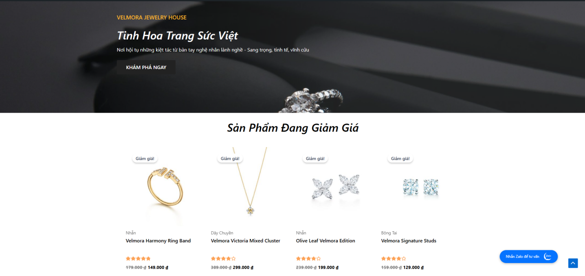
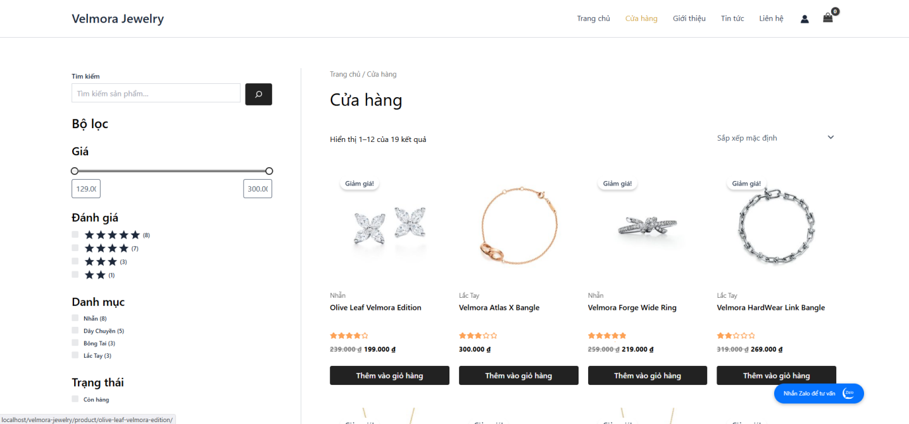
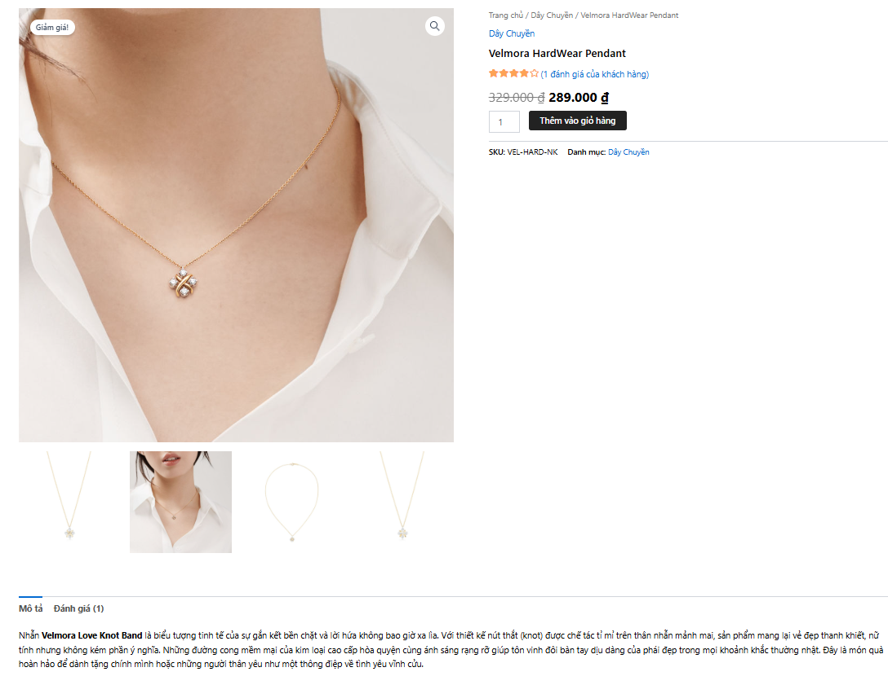
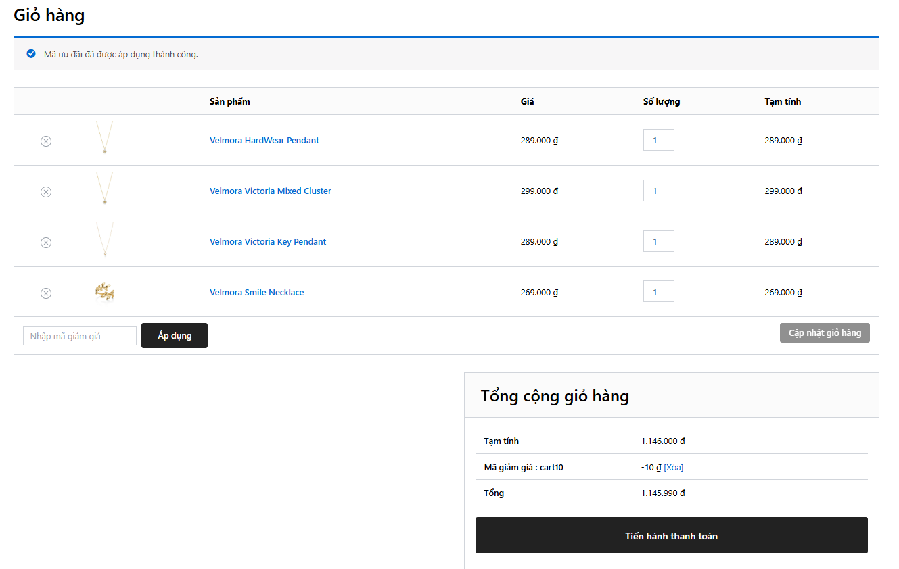
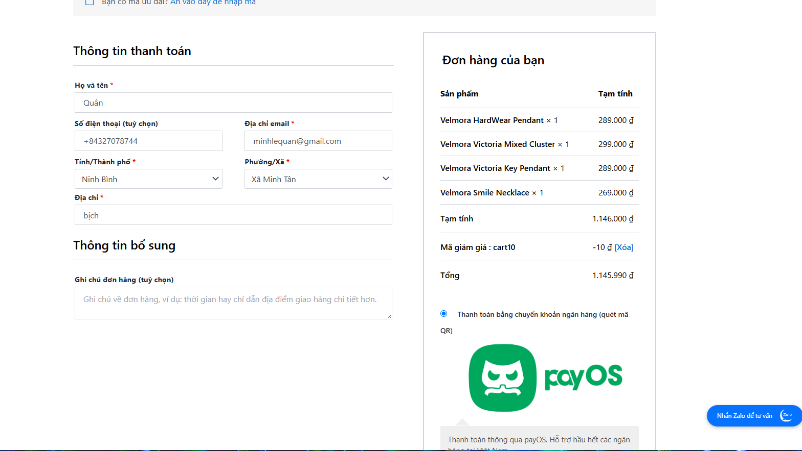
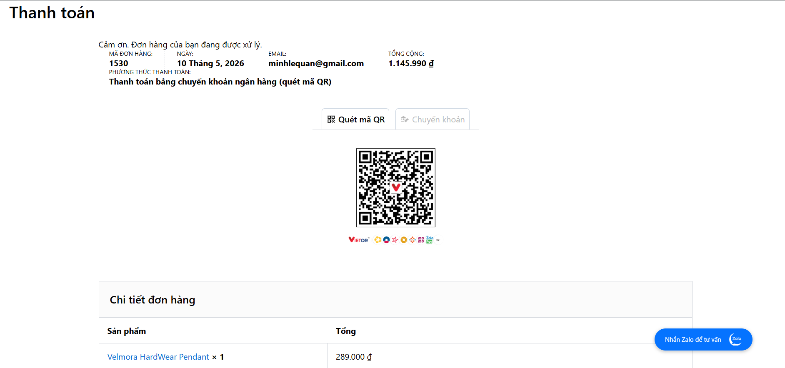
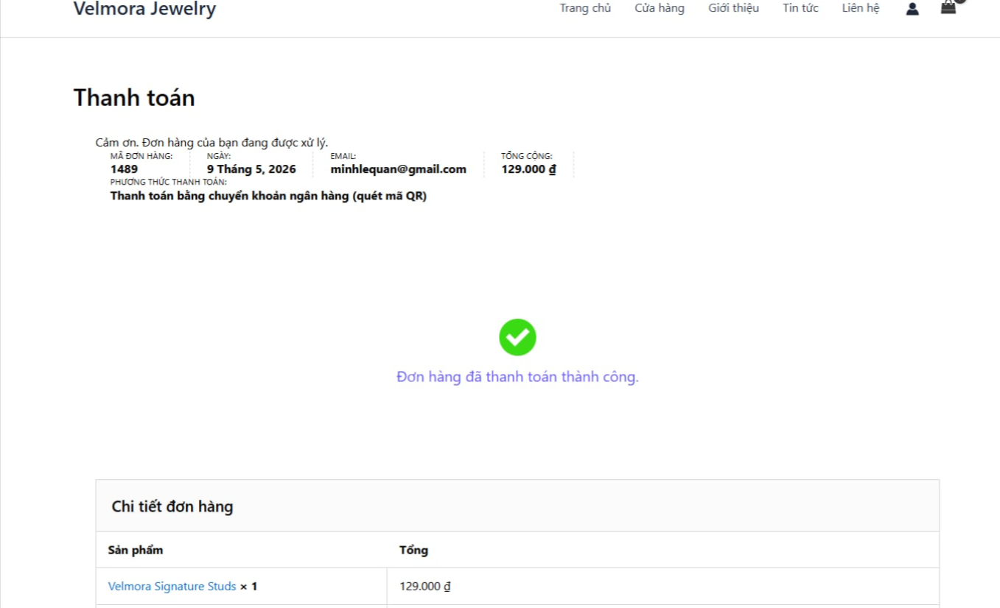
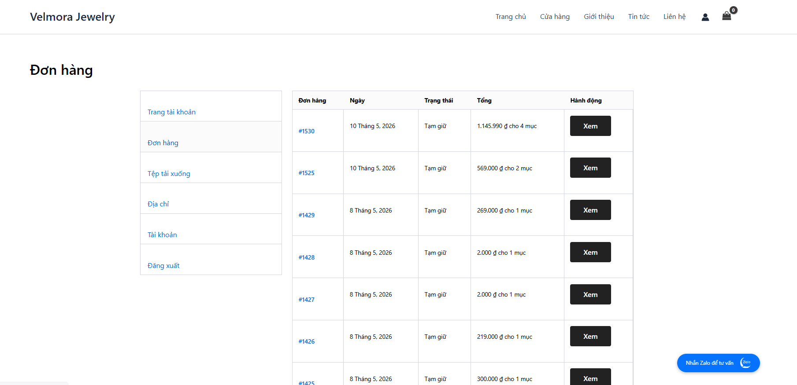

# Velmora Jewelry - Hệ thống Quản lý và Bán hàng Trang sức Cao cấp

## 1. Giới thiệu website/hệ thống
Velmora Jewelry Được nghiên cứu và phát triển dành riêng cho phân khúc trang sức cao cấp, hướng tới mục tiêu tối ưu hóa trải nghiệm khách hàng thông qua sự kết hợp giữa thẩm mỹ tinh tế và công nghệ vận hành hiện đại. Hệ thống sở hữu giao diện được thiết kế theo phong cách sang trọng, tối giản nhằm tập trung thị giác vào độ chi tiết và giá trị của các dòng sản phẩm kim hoàn, đồng thời đảm bảo tính tương thích và vận hành mượt mà trên đa nền tảng thiết bị. Bằng việc tích hợp các bộ lọc thông minh cùng khả năng hiển thị hình ảnh trực quan sắc nét, website cho phép người dùng dễ dàng truy xuất thông số kiểm định, phân tích chi tiết sản phẩm và thực hiện quy trình nghiệp vụ đặt hàng một cách an toàn, bảo mật, từ đó chuyển đổi mô hình mua sắm truyền thống sang một không gian số hóa chuyên nghiệp, tiện lợi.

**Các tính năng chính:**
- Hiển thị danh mục sản phẩm đa dạng (Nhẫn, Dây chuyền, Bông tai, v.v.).
- Giỏ hàng và thanh toán trực tuyến tích hợp.
- Quản lý tài khoản người dùng và lịch sử mua hàng.
- Hệ thống quản trị nội dung mạnh mẽ giúp dễ dàng cập nhật sản phẩm và khuyến mãi.
- Thiết kế đáp ứng (Responsive) tương thích với mọi thiết bị.

## 2. Danh sách thành viên & MSSV
| STT | Họ và Tên | MSSV |
|-----|-----------|------|
| 1   | [Lê Minh Quân] | [23810310115] |
| 2   | [Trần Quỳnh Anh] | [23810310147] |
| 3   | [Trần Minh Nguyệt] | [3810310081] |

## 3. Phân công nhiệm vụ cụ thể
| Thành viên | Nhiệm vụ chính | Chi tiết công việc |
|------------|----------------|-------------------|
| [Thành viên 1] | [Vai trò, VD: Trưởng nhóm] | Phân tích hệ thống, Thiết kế Database, Setup WordPress. |
| [Thành viên 2] | [Vai trò, VD: Designer] | Thiết kế UI/UX bằng Elementor, Chỉnh sửa hình ảnh sản phẩm. |
| [Thành viên 3] | [Vai trò, VD: Developer] | Cấu hình WooCommerce, Tùy biến chức năng thanh toán, SEO. |

## 4. Công nghệ sử dụng
Hệ thống được phát triển trên nền tảng Mã nguồn mở hiện đại, tối ưu cho thương mại điện tử:
- **Nền tảng chính (CMS):** [WordPress](https://wordpress.org/)
- **Giao diện (Theme):** [Astra Theme](https://wpastra.com/) (Tối ưu tốc độ và SEO)
- **Thương mại điện tử:** [WooCommerce](https://woocommerce.com/)
- **Thiết kế giao diện:** [Elementor](https://elementor.com/) & **Pro Elements**
- **Tiện ích bổ sung:** Essential Addons for Elementor, CartFlows (Tối ưu phễu bán hàng).
- **Thanh toán:** Tích hợp cổng thanh toán **PayOS**, **VietQR**, **Woo Vietnam Checkout**.
- **Ngôn ngữ lập trình:** PHP, HTML5, CSS3, JavaScript.
- **Cơ sở dữ liệu:** MySQL / MariaDB.
- **Môi trường phát triển:** XAMPP, Visual Studio Code.
- **Quản lý phiên bản:** Git / GitHub.

## 5. Hướng dẫn cài đặt chi tiết
Để hệ thống vận hành ổn định trên môi trường local, vui lòng thực hiện chính xác theo các bước sau:

### Bước 1: Chuẩn bị môi trường
- Cài đặt phần mềm **XAMPP** (Phiên bản hỗ trợ PHP 7.4 hoặc 8.x).
- Đảm bảo các cổng kết nối (Port 80, 443, 3306) không bị chiếm dụng.

### Bước 2: Thiết lập thư mục mã nguồn
1. Truy cập vào thư mục cài đặt XAMPP (mặc định là `C:\xampp\htdocs`).
2. Copy toàn bộ thư mục dự án `Velmora-jeweley-mnm` vào trong thư mục `htdocs`.
   - Đường dẫn chuẩn: `C:\xampp\htdocs\Velmora-jeweley-mnm`.

### Bước 3: Khởi động Server và Cơ sở dữ liệu
1. Mở **XAMPP Control Panel**.
2. Nhấn nút **Start** cho Module **Apache**.
3. Nhấn nút **Start** cho Module **MySQL**.
   - Đảm bảo cả hai module đều hiện màu xanh lá cây.

### Bước 4: Khởi tạo và Nhập dữ liệu (Import Database)
1. Mở trình duyệt và truy cập: `http://localhost/phpmyadmin/`.
2. Tại cột bên trái, nhấn **Mới** (New).
3. Nhập tên cơ sở dữ liệu là: `velmora_jewelry` và nhấn **Tạo**.
4. Chọn database `velmora_jewelry`, sau đó chọn tab **Nhập** (Import).
5. Nhấn **Chọn tệp** (Choose File) và trỏ tới file:
   `C:\xampp\htdocs\Velmora-jeweley-mnm\database\velmora_jewelry (6).sql`.
6. Nhấn nút **Nhập** (Import) ở cuối trang và đợi hệ thống báo thành công.

### Bước 5: Cấu hình tệp wp-config.php
1. Mở tệp `C:\xampp\htdocs\Velmora-jeweley-mnm\wp-config.php`.
2. Kiểm tra các thông số kết nối Database:
   ```php
   define( 'DB_NAME', 'velmora_jewelry' );
   define( 'DB_USER', 'root' );
   define( 'DB_PASSWORD', '' );
   define( 'DB_HOST', 'localhost' );
   ```
3. Đảm bảo URL hệ thống khớp với thư mục:
   ```php
   define( 'WP_HOME', 'http://localhost/Velmora-jeweley-mnm' );
   define( 'WP_SITEURL', 'http://localhost/Velmora-jeweley-mnm' );
   ```

### Bước 6: Hoàn tất
- Truy cập website: `http://localhost/Velmora-jeweley-mnm/`.
- Nếu gặp lỗi 404 ở các trang con: Vào **Trang quản trị -> Cài đặt -> Đường dẫn tĩnh** và nhấn **Lưu thay đổi**.

## 6. Hướng dẫn chạy project
1. **Trang chủ:** Truy cập `http://localhost/Velmora-jeweley-mnm/`.
2. **Trang quản trị:** Truy cập `http://localhost/Velmora-jeweley-mnm/wp-login/`.

## 7. Tài khoản demo
|Loại tài khoản | Username | Password |
|----------------|----------|----------|
|Quản trị viên  |admin  | admin123 |

## 8. Hình ảnh minh họa hệ thống
Dưới đây là một số hình ảnh thực tế của giao diện website **Velmora Jewelry**:

- **Trang chủ (Home Page):** Giao diện sang trọng với banner và các bộ sưu tập nổi bật.
  

- **TRANG CỬA HÀNG (Shop):** Hiển thị danh sách trang sức với bộ lọc thông minh.
  

- **Trang chi tiết sản phẩm (Product Details):** Hiển thị thông tin chi tiết về sản phẩm, giá cả, đánh giá và bình luận.
  

- **Trang giỏ hàng (Cart):** Hiển thị các sản phẩm đã thêm vào giỏ hàng, cho phép người dùng điều chỉnh số lượng hoặc xóa sản phẩm.
  

- **Trang thanh toán (Checkout):** Tích hợp thanh toán qua QR Code và PayOS.
  
  
  

- **Trang đơn hàng đã đặt (Orders):** Nơi khách hàng theo dõi lịch sử mua hàng và tình trạng đơn hàng.
  

- **Giao diện quản trị (Dashboard):** Quản lý sản phẩm, đơn hàng và khách hàng.
  

---

## 9. Video Demo hệ thống
Bạn có thể xem video hướng dẫn sử dụng và trải nghiệm các tính năng của hệ thống tại đây:
- **Link Video:** [Xem Video Demo tại đây](Dán_link_video_Youtube_hoặc_Drive_vào_đây)

---

## 10. Link online đã deploy
Dự án hiện tại đã được triển khai trực tuyến tại (nếu có):
- **Link Website:** [Đang cập nhật / Dán_link_vào_đây]

